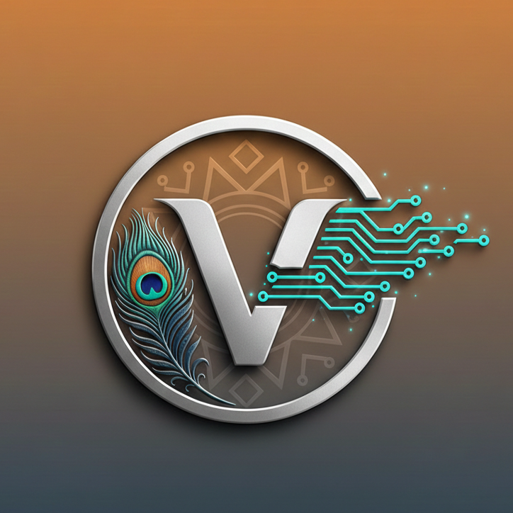

<div align="center">



# VYASA

### Compile Your Epic

A powerful, lightweight desktop note-taking app built with **Tauri 2 + React + TypeScript**.  
Glass-effect styling. System fonts. Side-by-side diffing. Screenshot capture. All in ~5MB.

_For Indians, by an Indian._ 🇮🇳

[](https://github.com/code-by-debanjan/vyasa-notetaking-app/releases)
[](https://v2.tauri.app/)
[](https://react.dev/)
[](https://typescriptlang.org/)
[](#license)

</div>

---

## 🖼️ Screenshots

> **Add your screenshots to the `screenshots/` folder** and they'll show up here automatically.

<div align="center">

| Dark Theme | Light Theme |
|:---:|:---:|
|  |  |

| Compare View | Font Selector |
|:---:|:---:|
|  |  |

</div>

---

## ✨ Features

<table>
<tr>
<td width="50%">

### 📝 Editor
- **Multi-tab editing** — Work on multiple files simultaneously
- **Find & Replace** — Full-text search with replace support
- **Line numbers** — Clean gutter display
- **Word wrap** — Toggle from the View menu
- **Zoom** — Ctrl+/Ctrl- to adjust font size
- **System font selector** — Searchable dropdown with all installed fonts

</td>
<td width="50%">

### 📂 File Management
- **Full file ops** — New, Open, Save, Save As with native OS dialogs
- **Any file type** — Save as `.txt`, `.config`, `.json`, `.yaml`, or any extension
- **Recent files** — Quick access from the File menu
- **File associations** — Open files directly from Windows Explorer
- **Single instance** — New files open as tabs, not new windows
- **Session persistence** — Tabs restored on reopen

</td>
</tr>
<tr>
<td width="50%">

### 🎨 Interface
- **Glass UI** — Backdrop-filter blur with purple accent theming
- **Dark/Light themes** — Persists across restarts
- **Custom title bar** — Branded with Vyasa logo
- **Status bar** — Line, column, word/char count, encoding
- **Unsaved changes detection** — Custom save prompt dialog

</td>
<td width="50%">

### 🔧 Power Tools
- **Compare Files** — Side-by-side diff with inline editing
- **Screenshot capture** — Save editor/compare view as PNG
- **Keyboard-driven** — Full set of standard shortcuts
- **Lightweight** — ~5MB installed via Tauri 2

</td>
</tr>
</table>

---

## ⌨️ Keyboard Shortcuts

| Shortcut | Action |
|:---|:---|
| `Ctrl+N` | New File |
| `Ctrl+O` | Open File |
| `Ctrl+S` | Save |
| `Ctrl+Shift+S` | Save As |
| `Ctrl+W` | Close Tab |
| `Ctrl+F` | Find |
| `Ctrl+H` | Find & Replace |
| `Ctrl+Shift+C` | Compare Files |
| `Ctrl+Shift+P` | Take Screenshot |
| `Ctrl++` | Zoom In |
| `Ctrl+-` | Zoom Out |

---

## 🚀 Getting Started

### Prerequisites

| Tool | Required | Install |
|:---|:---|:---|
| **Node.js** | v18+ | [nodejs.org](https://nodejs.org) |
| **Rust** | latest | [rustup.rs](https://rustup.rs) |
| **VS Build Tools** | Windows only | See below |

<details>
<summary><b>Install Visual Studio Build Tools (Windows)</b></summary>

```powershell
# Run as Administrator:
winget install Microsoft.VisualStudio.2022.BuildTools --override "--wait --passive --add Microsoft.VisualStudio.Workload.VCTools --includeRecommended"
```

</details>

### Development

```bash
# Install dependencies
npm install

# Start development (hot-reload frontend + Rust backend)
npm run tauri dev
```

### Production Build

```bash
npm run tauri build
```

Output:
- **Executable** → `src-tauri/target/release/vyasa-notetaking-app.exe`
- **MSI Installer** → `src-tauri/target/release/bundle/msi/`
- **NSIS Installer** → `src-tauri/target/release/bundle/nsis/`

---

## 📁 Project Structure

```
vyasa-notetaking-app/
├── public/
│   └── logo.png                # Vyasa brand logo
├── src/                        # React frontend
│   ├── main.tsx                # Entry point
│   ├── App.tsx                 # Main app (tabs, state, shortcuts)
│   ├── styles.css              # Themes & glass effects
│   ├── utils/
│   │   └── diff.ts             # LCS-based line diff algorithm
│   └── components/
│       ├── MenuBar.tsx         # File / Edit / View / Help menus
│       ├── TabBar.tsx          # Multi-tab bar with close buttons
│       ├── FontBar.tsx         # Font selector + screenshot button
│       ├── StatusBar.tsx       # Line / col / word count / encoding
│       └── CompareView.tsx     # Side-by-side diff with inline editing
└── src-tauri/                  # Tauri / Rust backend
    ├── Cargo.toml              # Rust dependencies
    ├── tauri.conf.json         # Tauri configuration & file associations
    └── src/
        ├── main.rs             # Rust entry point
        └── lib.rs              # Commands: file I/O, fonts, screenshots, session
```

---

## 🛠️ Tech Stack

<div align="center">

| Technology | Purpose |
|:---|:---|
| [**Tauri 2**](https://v2.tauri.app/) | Lightweight native app framework |
| [**React 18**](https://react.dev/) | UI component library |
| [**TypeScript**](https://typescriptlang.org/) | Type-safe JavaScript |
| [**Vite**](https://vitejs.dev/) | Fast dev server & bundler |
| [**html2canvas**](https://html2canvas.hertzen.com/) | DOM-to-image screenshot capture |
| [**font-enumeration**](https://crates.io/crates/font-enumeration) | System font discovery (Rust) |
| [**tauri-plugin-single-instance**](https://crates.io/crates/tauri-plugin-single-instance) | Single window enforcement |

</div>

---

## 📜 License

© 2026 Debanjan Bhattacharya. All rights reserved.
