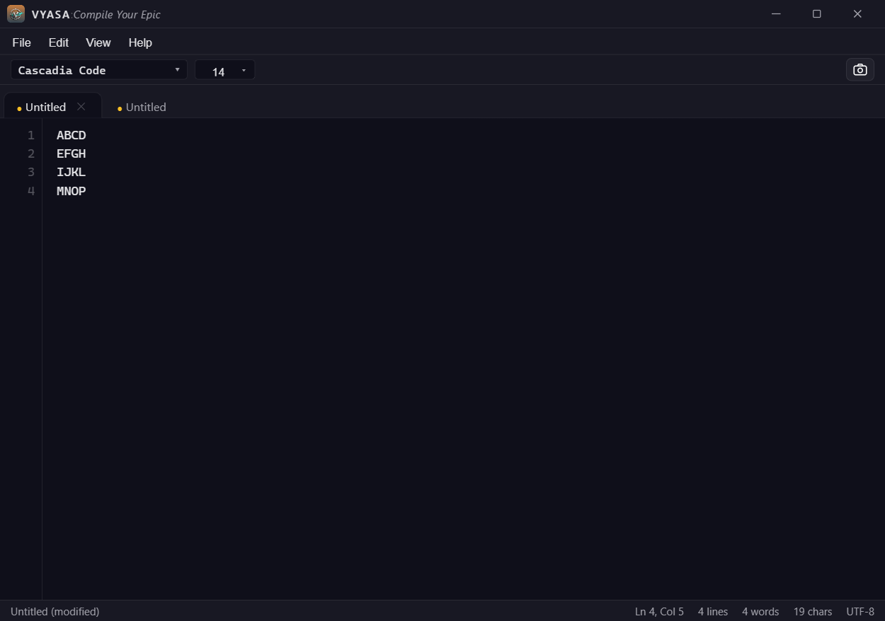
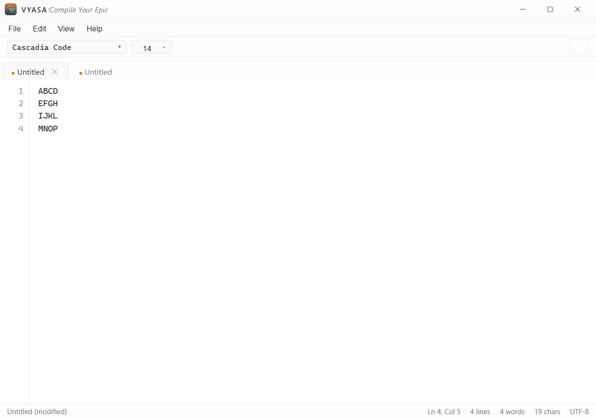
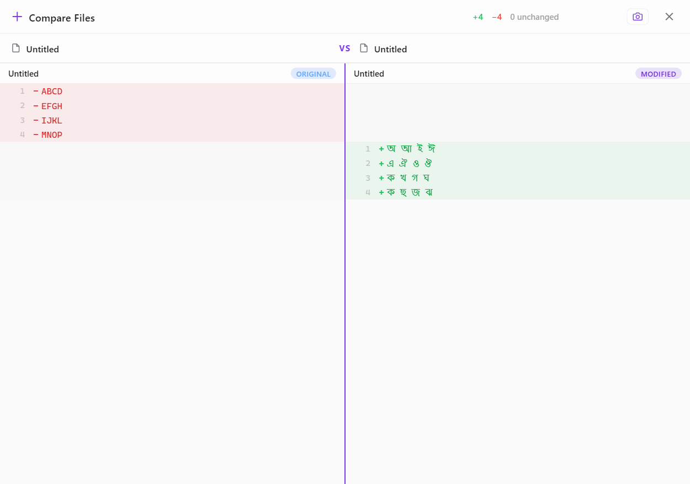
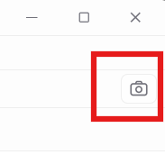
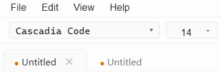

<div align="center">


# VYAS

### Compile Your Epic

A powerful, lightweight desktop note-taking app built with **Tauri 2 + React + TypeScript**.  
Glass-effect styling. System fonts. Side-by-side diffing. Screenshot capture. All in ~5MB.

_For Indians, by an Indian._ 🇮🇳

[](https://github.com/code-by-debanjan/vyas-notetaking-app/releases)
[](https://v2.tauri.app/)
[](https://react.dev/)
[](https://typescriptlang.org/)
[](#license)

</div>

---

## 🖼️ Screenshots

<div align="center">

<table>
<tr>
<td align="center" width="48%">
<br/>
<em>Dark Theme</em>
</td>
<td align="center" width="48%">
<br/>
<em>Light Theme</em>
</td>
</tr>
<tr>
<td align="center" width="48%">
<br/>
<em>Compare Files</em>
</td>
<td align="center" width="48%">
<br/>
<em>Take Screenshot</em>
</td>
</tr>
<tr>
<td align="center" width="48%">
<br/>
<em>Font Selector</em>
</td>
<td align="center" width="48%">
<br/>
<em>Support Indian Language</em>
</td>
</tr>
</table>

</div>

---

## ✨ Features

<table>
<tr>
<td width="50%">

### 📝 Editor

- **Multi-tab editing** — Work on multiple files simultaneously
- **Double-click new tab** — Double-click the tab bar to create a new file
- **Tab context menu** — Right-click a tab to Close or Open in File Explorer
- **Undo / Redo** — Full undo/redo history per tab
- **Per-tab font settings** — Each tab has its own font family and size
- **Find & Replace** — Full-text search with replace support
- **Line numbers** — Clean gutter display
- **Word wrap** — Toggle from the View menu
- **Zoom** — Ctrl+/Ctrl- to adjust font size per tab
- **System font selector** — Searchable dropdown with all installed fonts
- **Indian language support** — Write in Hindi, Bengali, and other Indic scripts

</td>
<td width="50%">

### 📂 File Management

- **Full file ops** — New, Open, Save, Save As with native OS dialogs
- **Export formats** — Save as CSV, JSON, XML, and PDF with automatic format conversion
- **Any file type** — Save as `.txt`, `.config`, `.json`, `.yaml`, or any extension
- **Recent files** — Quick access from the File menu
- **File associations** — Open files directly from Windows Explorer
- **Single instance** — New files open as tabs, not new windows
- **Session persistence** — Tabs restored on reopen

</td>
</tr>
<tr>
<td width="50%">

### 🎨 Interface

- **Glass UI** — Backdrop-filter blur with purple accent theming
- **Dark/Light themes** — Persists across restarts
- **Custom title bar** — Branded with Vyas logo
- **Status bar** — Line, column, word/char count, encoding
- **Unsaved changes detection** — Custom save prompt dialog

</td>
<td width="50%">

### 🔧 Power Tools

- **Compare Files** — Side-by-side diff with inline editing
- **Screenshot capture** — Save editor/compare view as PNG
- **Keyboard-driven** — Full set of standard shortcuts
- **Lightweight** — ~5MB installed via Tauri 2

</td>
</tr>
</table>

---

## ⌨️ Keyboard Shortcuts

| Shortcut       | Action          |
| :------------- | :-------------- |
| `Ctrl+Z`       | Undo            |
| `Ctrl+Y`       | Redo            |
| `Ctrl+N`       | New File        |
| `Ctrl+O`       | Open File       |
| `Ctrl+S`       | Save            |
| `Ctrl+Shift+S` | Save As         |
| `Ctrl+W`       | Close Tab       |
| `Ctrl+F`       | Find            |
| `Ctrl+H`       | Find & Replace  |
| `Ctrl+Shift+C` | Compare Files   |
| `Ctrl+Shift+P` | Take Screenshot |
| `Ctrl++`       | Zoom In         |
| `Ctrl+-`       | Zoom Out        |

---

##  Project Structure

```
vyas-notetaking-app/
├── public/
│   └── logo.png                # Vyas brand logo
├── src/                        # React frontend
│   ├── main.tsx                # Entry point
│   ├── App.tsx                 # Main app (tabs, state, shortcuts)
│   ├── styles.css              # Themes & glass effects
│   ├── utils/
│   │   ├── diff.ts             # LCS-based line diff algorithm
│   │   └── formatConverter.ts  # CSV, JSON, XML, PDF export converters
│   └── components/
│       ├── MenuBar.tsx         # File / Edit / View / Help menus
│       ├── TabBar.tsx          # Multi-tab bar with context menu
│       ├── FontBar.tsx         # Font selector + screenshot button
│       ├── StatusBar.tsx       # Line / col / word count / encoding
│       └── CompareView.tsx     # Side-by-side diff with inline editing
└── src-tauri/                  # Tauri / Rust backend
    ├── Cargo.toml              # Rust dependencies
    ├── tauri.conf.json         # Tauri configuration & file associations
    └── src/
        ├── main.rs             # Rust entry point
        └── lib.rs              # Commands: file I/O, fonts, screenshots, session
```

---

## 🛠️ Tech Stack

<div align="center">

| Technology                                                                                | Purpose                          |
| :---------------------------------------------------------------------------------------- | :------------------------------- |
| [**Tauri 2**](https://v2.tauri.app/)                                                      | Lightweight native app framework |
| [**React 18**](https://react.dev/)                                                        | UI component library             |
| [**TypeScript**](https://typescriptlang.org/)                                             | Type-safe JavaScript             |
| [**Vite**](https://vitejs.dev/)                                                           | Fast dev server & bundler        |
| [**html2canvas**](https://html2canvas.hertzen.com/)                                       | DOM-to-image screenshot capture  |
| [**jsPDF**](https://github.com/parallax/jsPDF)                                            | PDF document generation          |
| [**font-enumeration**](https://crates.io/crates/font-enumeration)                         | System font discovery (Rust)     |
| [**tauri-plugin-single-instance**](https://crates.io/crates/tauri-plugin-single-instance) | Single window enforcement        |

</div>

---

## 📜 License

This project is licensed under the **MIT License** — see the [LICENSE.txt](LICENSE.txt) file for details.

© 2026 Debanjan Bhattacharya.
